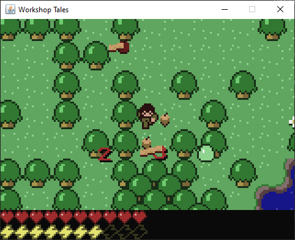
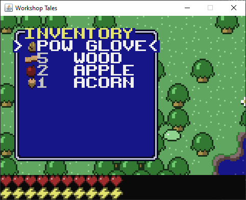
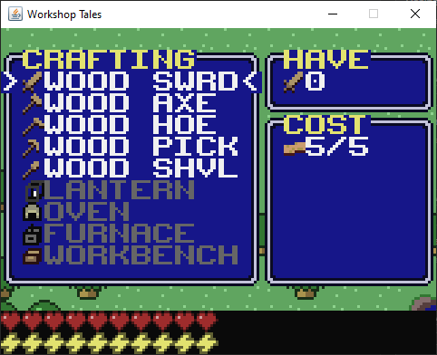
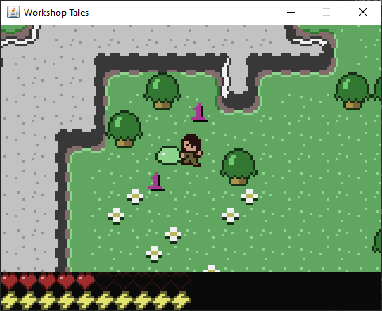
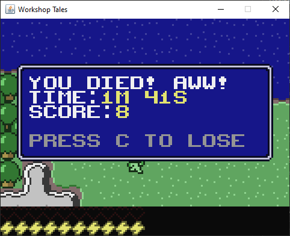

# Workshop Tales

A 2D top-down adventure game written in Java. This project is a complete creation featuring crafting, exploration, combat, and survival mechanics across multiple procedurally generated levels.

## Screenshots







## Features

- **Multi-level exploration**: Navigate through 5 different levels including surface, underground caves, and sky islands
- **Crafting system**: Create tools, furniture, and resources using workbenches, furnaces, ovens, and anvils
- **Combat mechanics**: Fight slimes, zombies, and the Air Wizard boss with various weapons
- **Resource management**: Mine ores, chop trees, farm crops, and manage stamina/health
- **Furniture system**: Place and interact with chests, lanterns, and crafting stations
- **Procedural generation**: Each world is randomly generated with different biomes and ore distributions

## Game Mechanics

### Tools & Equipment

- **5 tool tiers**: Wood, Rock, Iron, Gold, and Gem
- **Tool types**: Sword, Axe, Pickaxe, Shovel, and Hoe
- **Power Glove**: Pick up and move furniture pieces

### Resources & Materials

- **Basic materials**: Wood, Stone, Coal, Sand, Dirt
- **Ores**: Iron Ore, Gold Ore, Gems
- **Food**: Wheat, Bread, Apples
- **Special items**: Slime, Glass, Cloth, Cloud essence

### Levels

1. **Sky Level** (Level 4): Floating cloud islands with cloud cacti
2. **Surface** (Level 3): Grasslands, forests, deserts with various resources
3. **Cave Level 1** (Level 2): Underground with iron ore deposits
4. **Cave Level 2** (Level 1): Deeper caves with gold ore
5. **Deep Caves** (Level 0): Deepest level with gem deposits and lava

## Controls

- **Arrow Keys / WASD**: Move character
- **C / Space**: Attack/Use tools
- **X / Enter**: Open inventory/Interact with objects
- **Menu Navigation**: Arrow keys to select, C to confirm, X to go back

## Project Structure

```plaintext
Workshop-Tales/
├── src/com/soulwax/wstales/          # Source code
│   ├── Game.java                    # Main game class
│   ├── InputHandler.java            # Keyboard input handling
│   ├── crafting/                    # Crafting recipes and system
│   ├── entity/                      # Game entities (player, mobs, furniture)
│   ├── gfx/                         # Graphics rendering system
│   ├── item/                        # Items and tools
│   ├── level/                       # Level generation and management
│   ├── screen/                      # Game menus and UI
│   └── sound/                       # Audio system
├── res/                             # Game resources
│   ├── icons.png                    # Sprite sheet
│   ├── icons2.png                   # Additional sprites
│   └── *.wav                        # Sound effects
├── bin/                             # Compiled output directory
└── build.xml                        # Ant build configuration
```

## Building & Running

### Prerequisites

- Java Development Kit (JDK) 8 or higher
- Apache Ant (optional, for building)

### Using Ant

```bash
# Compile the project
ant compile

# Create JAR file
ant jar

# Run directly
ant run

# Clean build files
ant clean
```

### Manual Compilation

```bash
# Compile source files
javac -cp src -d bin src/com/soulwax/wstales/*.java src/com/soulwax/wstales/*/*.java

# Copy resources
cp -r res/* bin/

# Run the game
java -cp bin de.soulwax.wstales.Game
```

### Running the JAR

```bash
java -jar dist/Workshop\ Tales.jar
```

## Technical Details

### Architecture

- **Entity-Component System**: Modular entity design with inheritance
- **Level Management**: Multiple levels with seamless transitions
- **Tile-based Rendering**: 16x16 pixel tiles with sprite sheets
- **Custom Graphics Engine**: Software-based rendering with color palette system
- **Sound System**: WAV audio playback using Java Applet AudioClip

### Object-Oriented Design & Class Hierarchy

The codebase follows a well-structured OOP design with clear inheritance hierarchies and composition patterns:

#### Entity Hierarchy

```plaintext
Entity (abstract base)
├── Mob (movable entities with health/combat)
│   ├── Player (user-controlled character)
│   ├── AirWizard (final boss with special AI)
│   ├── Slime (jumping enemy with levels 1-4)
│   └── Zombie (walking enemy with levels 1-4)
├── Furniture (placeable interactive objects)
│   ├── Workbench (basic crafting station)
│   ├── Furnace (ore smelting)
│   ├── Oven (food preparation)
│   ├── Anvil (advanced tool crafting)
│   ├── Chest (storage container)
│   └── Lantern (light source)
├── ItemEntity (dropped items in world)
├── Spark (AirWizard projectile)
└── Particle (visual effects)
    ├── SmashParticle (impact effects)
    └── TextParticle (floating damage numbers)
```

#### Item System Hierarchy

```plaintext
Item (interface: ListItem)
├── ToolItem (weapons and tools with 5 tiers)
├── ResourceItem (stackable materials)
├── FurnitureItem (placeable furniture)
└── PowerGloveItem (special furniture interaction tool)
```

#### Tile System Hierarchy

```plaintext
Tile (abstract base for world blocks)
├── GrassTile (spreads to adjacent dirt)
├── DirtTile (diggable, can be farmed)
├── RockTile (minable with pickaxe)
├── TreeTile (choppable with axe)
├── WaterTile (swimmable liquid)
├── LavaTile (damaging liquid with light)
├── OreTile (iron/gold/gem deposits)
├── FarmTile (for growing crops)
├── WheatTile (harvestable crop)
└── StairsTile (level transitions)
```

#### Screen & UI Hierarchy

```plaintext
Menu (abstract UI base)
├── TitleMenu (main menu)
├── InventoryMenu (item management)
├── CraftingMenu (recipe interface)
├── ContainerMenu (chest/storage)
├── DeadMenu (game over screen)
├── WonMenu (victory screen)
└── AboutMenu (credits/info)
```

#### Crafting System Hierarchy

```plaintext
Recipe (abstract crafting template)
├── ToolRecipe (creates tools with materials)
├── ResourceRecipe (transforms resources)
└── FurnitureRecipe (creates placeable objects)
```

#### Key Design Patterns

**Entity-Component Pattern**: Entities have modular components like `Inventory`, health, collision bounds (`xr`, `yr`), and behavior methods.

**Strategy Pattern**: Different tile types implement unique `interact()`, `hurt()`, and `tick()` behaviors while sharing the base `Tile` interface.

**Factory Pattern**: `LevelGen` uses factory methods to create different level types (surface, underground, sky) with appropriate tile distributions.

**Observer Pattern**: The `InputHandler` observes keyboard events and notifies the game state, with key objects that track press/release states.

**State Pattern**: Game states are managed through the `Menu` system, allowing clean transitions between gameplay, inventory, crafting, and other modes.

### Key Classes

- `Game.java`: Main game loop, rendering, and state management
- `Level.java`: World generation, entity management, and tile updates  
- `Player.java`: Player character with inventory, crafting, and interaction
- `LevelGen.java`: Procedural world generation using noise algorithms
- `Screen.java`: Low-level graphics rendering and sprite management

### Performance Features

- Efficient tile-based collision detection
- Spatial partitioning for entity management
- Optimized rendering with dirty rectangle updates
- Memory-efficient sprite sheet system

## Game Progression

1. **Start**: Begin on the surface with basic tools
2. **Gather Resources**: Collect wood, stone, and basic materials
3. **Craft Tools**: Create better equipment for mining and combat
4. **Explore Underground**: Mine ores and fight stronger enemies
5. **Advanced Crafting**: Smelt ingots and create high-tier equipment
6. **Sky Islands**: Access the upper level for cloud resources
7. **Final Boss**: Defeat the Air Wizard to win the game

## Recommended development platform

- **Java 8 or higher**: For compatibility with the game's features
- **Apache Ant**: For building and running the project easily
- **IntelliJ IDEA or Eclipse**: For a robust Java development environment

The game was developed using Eclipse.

## License

This project is licensed under the GNU General Public License v3.0 - see the [LICENSE.md](LICENSE.md) file for details.

---

> "A charming little game reminiscent of classic adventure games with modern crafting mechanics, pretty cool brah" - Some guy
